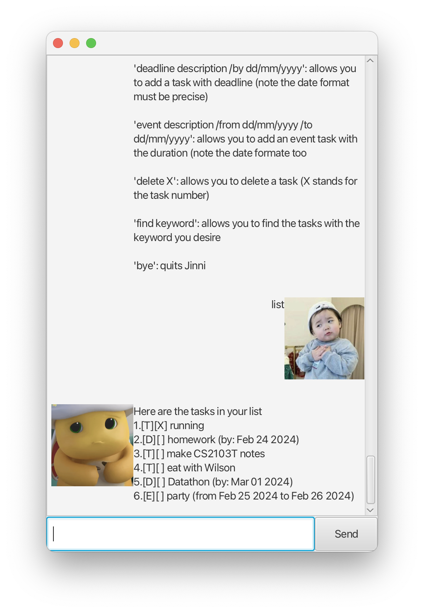

# Jinni User Guide


Before using, ensure that you have installed java 11 or above
## Jinni is a chatbot that assists you in managing the tasks you need to do. She can handle 3 types of tasks:

### Adding todos
***
Follow the command format below to add a *todo* task

`todo <description>`

After you tab `return` key, you will see response like the one below

```
Got it. I've added this task:
  [T][] running
Now you have 2 tasks in the list
```
* In the example above, the task description is *running*  
* There's a *T* in the first [ ], which stands for task of type *todo*  
* The next [ ] is for marking the task as done or undone (the example shows that the task is undone as the box is empty)

### Adding deadlines
***
Follow the command format below to add a *deadline* task

`deadline <description> /by dd/MM/yyyy`

After you tab `return` key, you will see response like the one below

```
Got it. I've added this task:
  [D][] homework (by: Feb 02 2024)
Now you have 3 tasks in the list
```
* In the example above, the task description is *homework*
* There's a *D* in the first [ ], which stands for task of type *deadline*
* The next [ ] is for marking the task as done or undone (the example shows that the task is undone as the box is empty)
* Remember the / before *by* and follow the date format as dd/MM/yyyy


### Adding events
***
Follow the command format below to add a *event* task

`event <description> /from dd/MM/yyyy /to dd/MM/yyyy`

After you tab `return` key, you will see response like the one below

```
Got it. I've added this task:
  [E][] open house (from Feb 02 2024 to Feb 03 2024)
Now you have 4 tasks in the list
```
* In the example above, the task description is *open house*
* There's a *E* in the first [ ], which stands for task of type *event*
* The next [ ] is for marking the task as done or undone (the example shows that the task is undone as the box is empty)
* Remember the / before *from* and *to* and follow the date format as dd/MM/yyyy

## Besides adding tasks, Jinni also allows you to manage your tasks
### List all your tasks
***
Follow the command format below to *list* your tasks

`list`

After you tab `return` key, you will see response like the one below

```
Here are the tasks in your list
1.[T][X] running
2.[D][] homework (by: Feb 24 2024)
3.[E][] open house (from Feb 02 2024 to Feb 03 2024)
```
### Mark a task as done
***
Follow the command format below to *mark* your task as done

`mark x`, where *x* stands for the task number

After you tab `return` key, you will see response like the one below

```
Nice! I have marked this task as done
[T][X] running
```
* Now the second [ ] as an *X* in it, representing a task has been completed

### Unmark a task as undone 
***
Follow the command format below to *unmark* a task as undone

`unmark x`, where *x* stands for the task number

After you tab `return` key, you will see response like the one below

```
Ok, I've marked this task as not done yet
[T][] running
```
* Now the second [ ] is empty again, meaning the task is not done yet

### Delete a task from the task list
***
Follow the command format below to *delete* a task

`delete x`, where *x* stand for the task number

After you tab `return` key, you will see response like the one below

```
Noted. I've removed this task:
  [T][X] running
Now you have 3 tasks in the list
```
### Find a task in the task list
***
Follow the command format below to *find* a task

`find <keyword>`, where *keyword* is a part of task description you are looking for 

After you tab `return` key, you will see response like the one below

```
Here are the matching tasks in your list:
1.[T][] running
2.[T][X] run with peter
```
### Close the chatbot
***
Simple type `bye` followed by the `return` key, you will see the response below:
```
Bye. Hope to see you again soon!
```
Wait for 2 seconds, the chatbot will be closed
